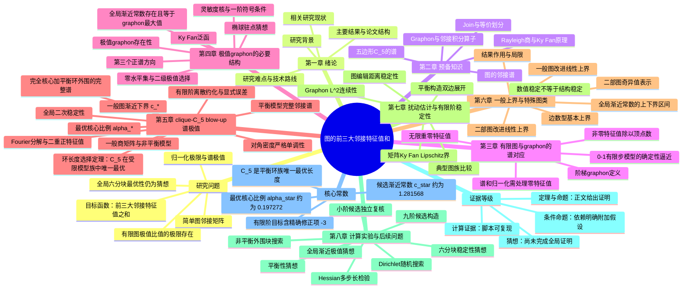

# 图的前三大邻接特征值和：论文思维导图

```mermaid
mindmap
  root((图的前三大邻接特征值和))
    研究问题
      简单图邻接矩阵
      目标函数：前三大邻接特征值之和
      归一化极限与谱极值
      有限图极值比值的极限存在
      全局六分块最优性仍为猜想
    第一章 绪论
      研究背景
      相关研究现状
      研究难点与技术路线
      主要结果与论文结构
    第二章 预备知识
      图的邻接谱
      Rayleigh商与Ky Fan原理
      Graphon与邻接积分算子
      五边形C_5的谱
      Join与等价划分
    第三章 有限图与graphon的谱对应
      阶梯graphon定义
      非零特征值除以顶点数
      无限重零特征值
      谱和归一化需处理零特征值
      0-1有限步模型的确定性逼近
    第四章 极值graphon的必要结构
      Ky Fan泛函
      极值graphon存在性
      全局渐近常数存在且等于graphon最大值
      第三个正谱方向
      灵敏度核与一阶符号条件
      零水平集与二级极值选择
      椭球驻点猜想
    第五章 clique-C_5 blow-up谱极值
      一般商矩阵与非平衡模型
      平衡模型完整邻接谱
      完全核心加平衡环外围的完整谱
      环长度选择定理：C_5 在受限模型族中唯一最优
      Fourier分解与二重正特征值
      对角密度严格单调性
      最优核心比例 alpha_*
      全局二次稳定性
      有限阶离散约化与显式误差
      一般图渐近下界 c_*
    第六章 一般上界与特殊图类
      边数型基本上界
      一般图改进线性上界
      二部图奇异值表示
      二部图改进线性上界
      全局渐近常数的上下界区间
      结果作用与局限
    第七章 扰动估计与有限阶稳定性
      矩阵Ky Fan Lipschitz界
      图编辑距离稳定性
      Graphon L^2连续性
      平衡构造双边展开
      典型图族比较
      数值稳定不等于结构稳定
    第八章 计算实验与后续问题
      小阶候选独立复核
      九阶候选构造
      非平衡外围块搜索
      Hessian多步长检验
      Dirichlet随机搜索
      平衡性猜想
      全局渐近极值猜想
      六分块稳定性猜想
    证据等级
      定理与命题：正文给出证明
      条件命题：依赖明确附加假设
      计算证据：脚本可复现
      猜想：尚未完成全局证明
    核心常数
      最优核心比例 alpha_star 约为 0.197272
      候选渐近常数 c_star 约为 1.281568
      有限阶目标含精确修正项 -3
      C_5 是平衡环族唯一最优长度
```

说明：思维导图只保留公式的文字含义与数值摘要，精确数学表达以论文正文为准。
